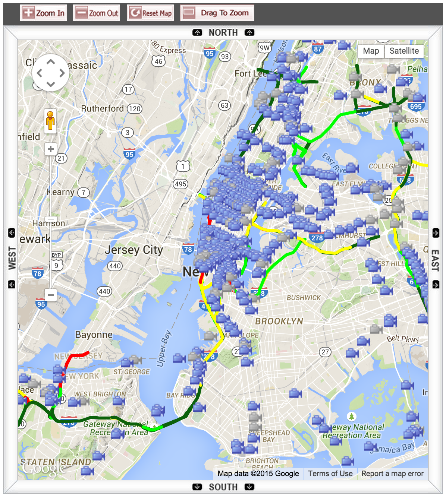

# NYC Traffic Service

Stores and provides historical traffic data from the NYC DOT, making it available over HTTP.



The New York City Department of Transportation provides [data services](http://www.nyc.gov/html/dot/html/about/datafeeds.shtml#realtime) for retrieving live traffic data about certain common transportation paths in and around NYC. (You can currently download this data [here](http://207.251.86.229/nyc-links-cams/LinkSpeedQuery.txt) as a tab-delimited CSV file.) This service does not contain any historic traffic data, but a snapshot in time, which is usually updated every minute or so.

This Node.js application queries this data every minute and stores it in Redis. It also exposes some simple HTTP endpoints for retrieving the stored historical data. 

## Requires

- [Node.js](http://nodejs.org)
- [Redis](http://redis.io/)

## Installation

Set the `REDIS_URL` environment variable to point to Redis.

## Running

    npm start

Once running, this program will collect data from the NYC DOT every minute and store it for retrieval via HTTP.

## Data Retrieval via HTTP

All endpoints below are JSONP-ready with the `?callback=foo` pattern.

### Getting All Traffic Paths

The NYC DOT data consists of "path" objects containing an array of coordinates along that path. To see all the available path IDs, query the following endpoint

    /paths/

Returns a list of integers representing each path, including a count.

```
{
    "pathIds":[
        1,
        2,
        ...
        453
    ],
    "count":153
}
```

### Getting One Traffic Path's History

    /:pathId/

Returns a sorted list of paths, ascending by date.

```
[
    {
        "Id":1,
        "Speed":14.91,
        "TravelTime":348,
        "Status":0,
        "DataAsOf":"6/5/2015 20:30:00",
        "linkId":4616337,
        "linkPoints":"40.74047,-74.009251 40.74137,-74.00893 40.7431706,-74.008591 40.7462304,-74.00797 40.74812,-74.007651 40.748701,-74.007691 40.74971,-74.00819 40.75048,-74.008321 40.751611,-74.00789 40.7537504,-74.00704 40.75721,-74.00463 40.76003,-74.002631 40.7607405,-7",
        "EncodedPolyLine":"}btwFx|ubMsD_AgJcAcR{ByJ_AsBFiEbByCXaFuAkLiDsTaNsPoKmCmB",
        "EncodedPolyLineLvls":"BBBBBBBBBBBBB",
        "Owner":"NYC_DOT_LIC",
        "Transcom_id":4616337,
        "Borough":"Manhattan",
        "linkName":"11th ave n ganservoort - 12th ave @ 40th st"
    },
    ...
    {
        "Id":1,
        "Speed":9.94,
        "TravelTime":508,
        "Status":0,
        "DataAsOf":"6/6/2015 00:11:01",
        "linkId":4616337,
        "linkPoints":"40.74047,-74.009251 40.74137,-74.00893 40.7431706,-74.008591 40.7462304,-74.00797 40.74812,-74.007651 40.748701,-74.007691 40.74971,-74.00819 40.75048,-74.008321 40.751611,-74.00789 40.7537504,-74.00704 40.75721,-74.00463 40.76003,-74.002631 40.7607405,-7",
        "EncodedPolyLine":"}btwFx|ubMsD_AgJcAcR{ByJ_AsBFiEbByCXaFuAkLiDsTaNsPoKmCmB",
        "EncodedPolyLineLvls":"BBBBBBBBBBBBB",
        "Owner":"NYC_DOT_LIC",
        "Transcom_id":4616337,
        "Borough":"Manhattan",
        "linkName":"11th ave n ganservoort - 12th ave @ 40th st"
    }
]
```

#### Filtering by Date

You may use the URL parameters `since` and `until`, providing a [UNIX timestamp](http://en.wikipedia.org/wiki/Unix_time). For example, the following will retrieve traffic data from Jan 1, 2015 (UNIX timestamp `1420099200`) until Mar 1, 2015 (UNIX timestamp `1425196800`).

    /1?since=1420099200&until=1425196800

